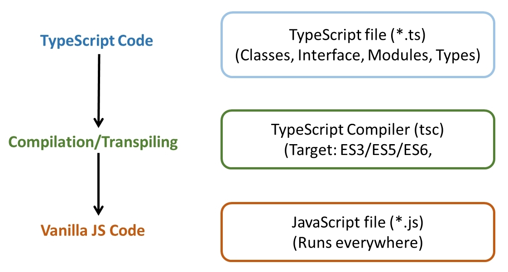

# Le compilateur TypeScript

TypeScript est un sur-ensemble typé de JavaScript qui nécessite une étape de compilation pour convertir le code TypeScript (.ts) en code JavaScript (.js) exécutable par les navigateurs ou les environnements Node.js.

## Processus

1. **Écriture du code TypeScript** : Vous écrivez votre code dans des fichiers avec l'extension `.ts`.
2. **Compilation** : Vous utilisez le compilateur TypeScript (`tsc`) pour compiler vos fichiers `.ts` en fichiers `.js`. Le compilateur vérifie également les types et signale les erreurs potentielles.
3. **Exécution** : Le code JavaScript généré peut être exécuté dans n'importe quel environnement JavaScript comme les navigateurs web, Node.js, Bun, Deno, etc...




## Installation du compilateur TypeScript

```
npm install -g typescript

OU

npm install --save-dev typescript
```

## Lancement de la compilation

Pour compiler un fichier TypeScript, utilisez la commande suivante dans votre terminal :

```
npx tsc nom-du-fichier.ts
```

## Compatibilité selon la plateforme

TypeScript peut être compilé pour cibler différentes versions de JavaScript, ce qui permet de s'assurer que le code généré est compatible avec les environnements spécifiques où il sera exécuté.

Créez un fichier `tsconfig.json` à la racine de votre projet pour configurer les options de compilation. Voici un exemple de configuration minimale :

```json
{
  "include": ["src/*.ts"],
  "compilerOptions": {
    "target": "esnext",
    "moduleResolution": "bundler"
  }
}
```

- `target`: Spécifie la version de JavaScript que le code compilé doit cibler (par exemple, `es5`, `es6`, `esnext`).
- `moduleResolution`: Définit la stratégie de résolution des modules (par exemple, `node`, `bundler`).


