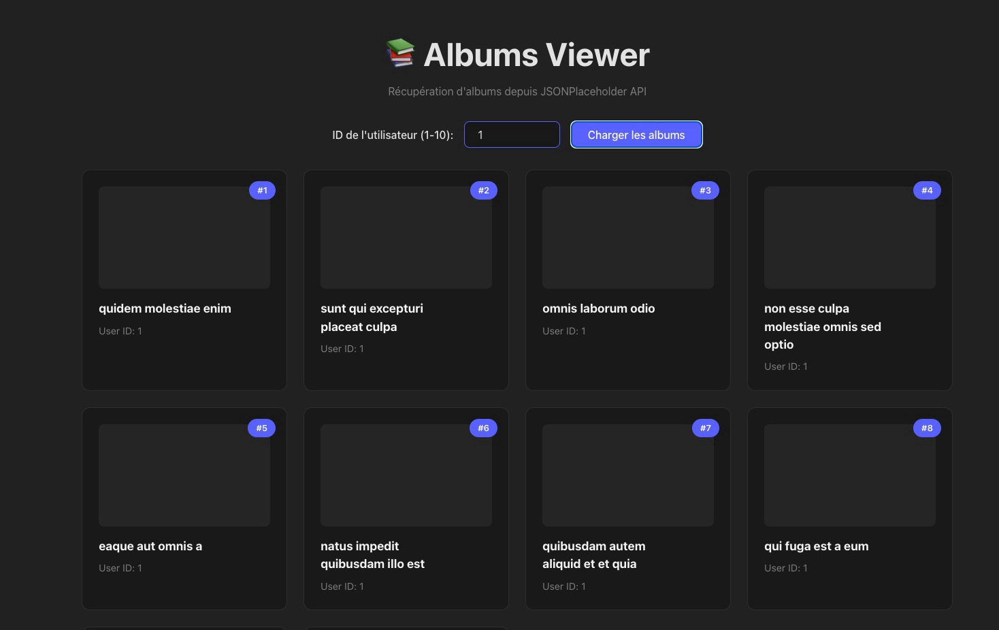

# Exercice d'interaction avec une API externe en TypeScript

Via browser (Vite + Typescript)

## Objectifs

Créer un petit programme qui récupère les albums d'un utilisateur depuis l'API JSONPlaceholder (https://jsonplaceholder.typicode.com/). Veuillez également afficher la première photo de chaque album.

Veillez à bien typer les données récupérées depuis l'API.

